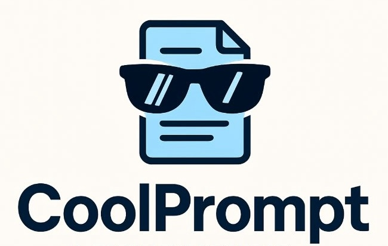

<p align="center">
    
</p>

<p>
	
    <a href="https://itmo.ru/"></a>
</p>

<h4 align="center">
    <p>
        <b>English</b> |
        <a>Русский</a>
    </p>
</h4>

CoolPrompt is a framework for automative prompting creation.


## Quickstart

- Install requirements with:
```
pip install -r requirements.txt
```
- Import and initialize PromptTuner
```
from coolprompt.assistant import PromptTuner

tuner = PromptTuner()
```
- Run PromptTuner instance with initial prompt:
```
# Define an initial prompt
prompt="Make a summarization of 2+2"

# Run a prompt optimisation
new_prompt=tuner.run(start_prompt=prompt)

# Get your new prompt
print(new_prompt)
```
- Get metrics for initial and final prompts when running with dataset:
```
from datasets import load_dataset

sst2 = load_dataset("sst2")
dataset = sst2['train']['sentence']
targets = sst2['train']['label']

# Define an initial prompt
start_prompt = '''
Please perform Sentiment Classification task.

Answer using the label from [0, 1], where 0 stands for negative, 1 stands for positive.
Generate the final answer bracketed with <ans> and </ans>.

The input:
'''

# Call prompt optimization with dataset and target
tuner = PromptTuner()
final_prompt = tuner.run(start_prompt=start_prompt,
                         task="classification",
                         dataset=dataset,
                         target=targets,
                         metric="accuracy")

# Get new prompt and metrics from tuner fields
print("PROMPT:", final_prompt)
print("INITIAL METRIC:", tuner.init_metric)
print("FINAL METRIC:", tuner.final_metric)
```

- Explore more examples in `notebooks/` folder to familiarize yourself with our framework
